# Iteration 13: UX and UI audit

*10 September 2026. Branch `iteration-12` at `22c599a`. The owner's brief was:
"audit UX and UI right now the UI seems complicated."*

**Method.** I built the Debug app and ran it on the `ws-l1` simulator with
fixtures: `release-garage-day40`, `release-studio-day400`,
`release-campus-day900` and `l3-family-day900`, plus a fresh daily company
for week 1. I photographed 21 screens, which are in
[`iteration-13-ux-audit/`](iteration-13-ux-audit/). I also read the tab
roots, the rail, the front door, the decision sheet and all 25 Life cards.
`simctl` cannot tap or scroll, so four things are judged from code rather
than photographed: the bottom of Life, the money sheet, the hiring sheet and
product detail. Each finding below says which it is. Nothing in the app was
changed, and no tests were added.

---

## A. Diagnosis

The game is not deep in a confusing way. It is **wide in a flat way**.
Iterations 9–12 added about fifteen systems, and each one was added as a new
peer at the top level: another card at the bottom of Life, another row on
the front door, another way to ask the player something. Nothing was added
as a child of something that already existed.

- **Life.** 25 card slots. 19–20 render on every fixture, under 4 headers,
  showing about 130 numbers and 52 controls on the family save. Seven of
  them are pitches for rooms the player has never entered (crime, assets,
  fame, family drama, side project, sabbatical, life score). They render on
  every fixture, including day 40 in a garage.
- **Front door.** 15 entry points.
- **Questions.** 15 kinds of question (`QueueKind`) reach the player through
  7 different surfaces.
- **Navigation.** Each tab has its own grammar: a scroll of sheets on HQ,
  17 pushed pages on Life, a segmented picker on Team and Products, a
  two-row six-pill bar on Business with a second segmented picker inside it.
  About 12 presentation mechanisms in all; a new player meets at least 8 of
  them in the first ten minutes.
- **Chrome.** The HUD plus a three-line coach tip take **21% of the screen
  on every tab**, and 31% on Business once the pill bar is added. The same
  tip repeats on all five tabs.
- **Hierarchy.** Every card has the same weight, so nothing says "this one
  first".
- **Wayfinding.** Coach tips give directions ("The feed, under Life…",
  "…is under Assets"). 9 tip strings do this, because the rooms are not
  where the player is looking.
- **Signals.** The one badge on Life reads **102**: unread phone messages,
  56 of them the company's own weekly closes. It signals nothing.

The systems are good and mostly well connected. What makes the game feel
complicated is how they are presented: every one of them is shown all the
time, at the same weight, from the first day.

---

## B. The ten biggest problems, ranked

### 1. Life is a 25-slot flat stack, and the new rooms are appended at the bottom

| Garage d40 | Campus d905 | Studio d400 |
|---|---|---|
| 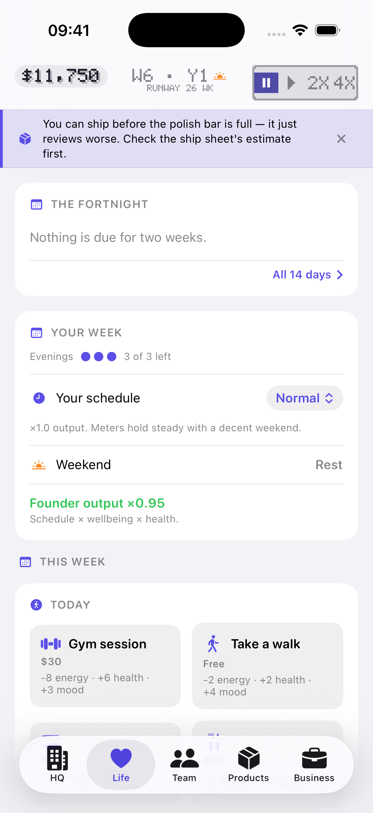 | 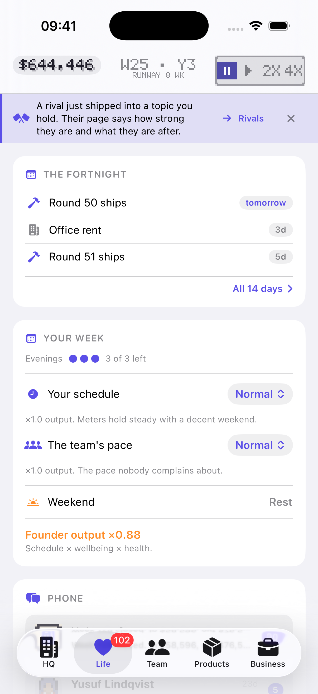 | 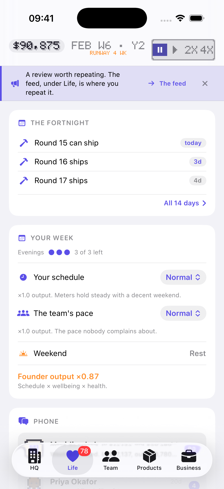 |

**Measured.** `LifeScreen.swift:94-170` stacks 25 cards under 4 headers.
Visible cards: garage 19, campus 20, family 20. `ChildrenLink` is a
zero-height view; Possessions, Inside and Doors hide themselves when empty.

The first viewport holds only the Fortnight and Your week. The first
decision a player can act on (Today's activities) starts at about 1,450 of
2,000 px on the garage save.

"You" holds 12 cards. Crime, Assets, Fame, Family drama, Side project,
Sabbatical and Life score are *always* drawn, as invitations, on all four
fixtures. The Doors card (iteration 12's headline) is card 25 of 25.

The populated family save shows about 130 numbers and 52 controls on one
scroll. 11 cards are nothing but a button that pushes a page.

**Who it hurts.** In hour one, a wall of scroll. In hour ten, the player
cannot find the room they want, which is why tips have to say "under Life".

### 2. Chrome takes a fifth of the screen on every tab, and the tip repeats on all five

| Garage HQ (tip) | Campus Business (tip + two-row pills) | Campus HQ, queue on the rail |
|---|---|---|
| 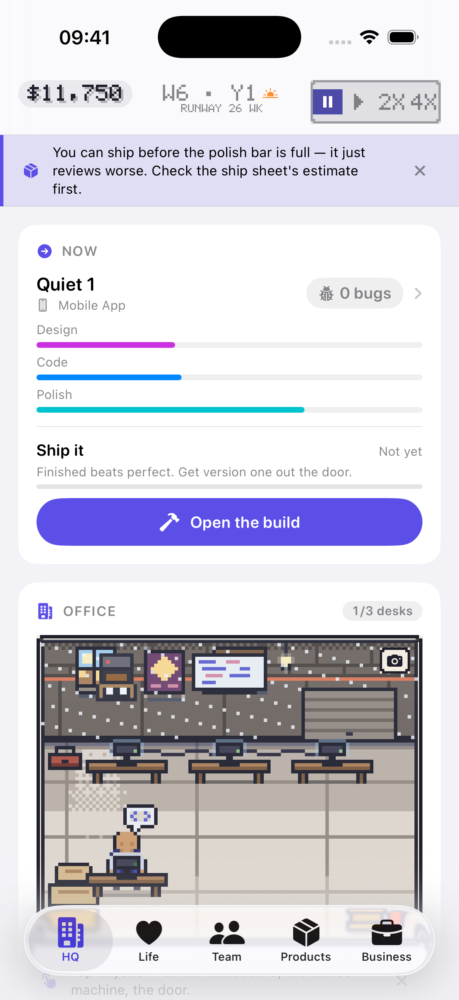 | 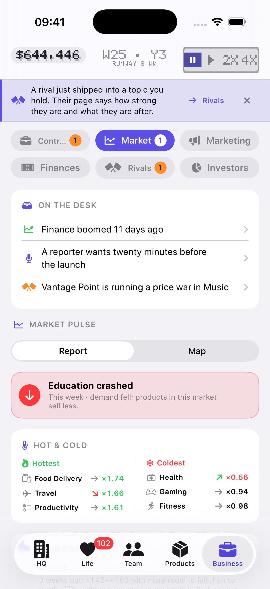 | 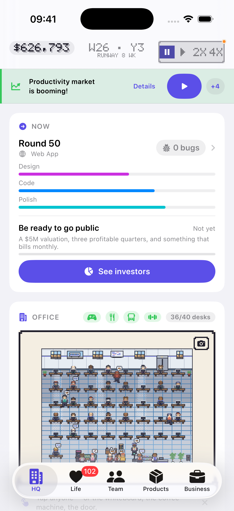 |

**Measured.** HUD plus rail run from 0 to 412 px of 2,000 (21%) on every
tab, because the coach tip wraps to three lines. The garage save shows the
*same* polish-bar tip on HQ, Life, Team, Products and Business; the campus
save shows the same rival tip on all five.

On Business, the six pills lay out as a 3×2 grid, which ends at 625 px
(31%). Add the floating tab bar (about 190 px) and 41% of the Business
screen is chrome. "Contracts" still truncates to "Contr…" once it carries
a badge.

HQ has a second tip surface of its own: "Tap anyone — or the whiteboard…"
under the office (`OfficeTaps.swift:148`).

When a question is waiting, the rail carries five targets in one row:
headline, Details, ▶, +4, and a dot on the speed control.

**Who it hurts.** Hour one most. It is the first thing on every screen, and
it is the same sentence five times.

### 3. A question can reach you seven ways

| Week-1 poach, fresh daily | The shark, a door page | Phone, campus |
|---|---|---|
| 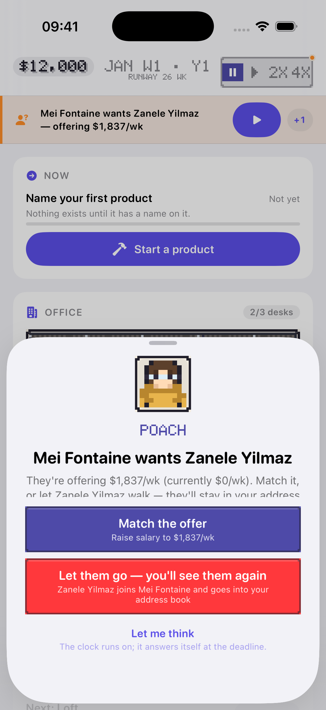 | 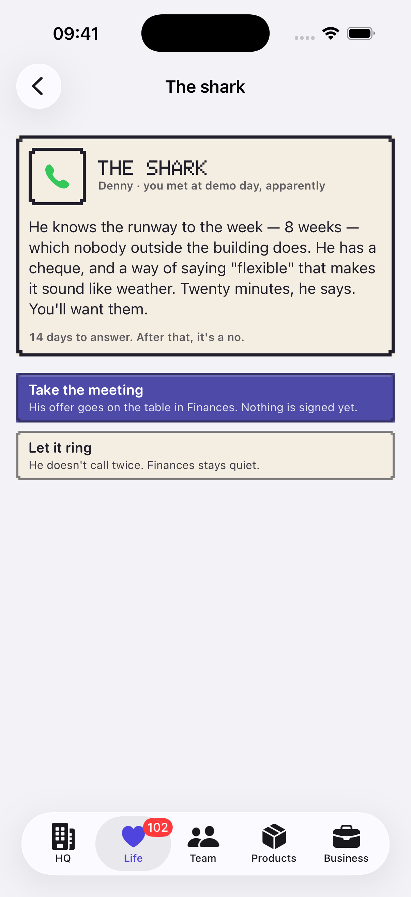 | 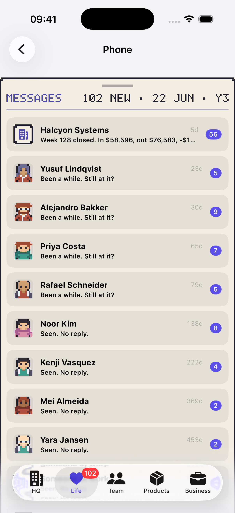 |

**Measured.** `QueueKind` has 15 kinds (`Queue.swift:32`). They reach the
player through 7 surfaces:

1. The modal `DecisionSheet`.
2. A deferred row on the rail.
3. A room page. The case, hearing, funeral, dirty money and cancellation
   each route to their own room (`NoticeRail.swift:187-196`).
4. A phone thread with reply buttons.
5. A door page, pushed on Life.
6. A row on Business's desk ("A reporter wants twenty minutes").
7. The front door's Morning desk ("Message · Decision · Tap").

The Fortnight and the phone's company thread also restate dated items.

The fresh daily company got a poach sheet on day 7, for an employee on
"$0/wk", before the player had named a product.

**Who it hurts.** Hour ten most: there is no single "what is waiting on me"
list. The rail's +N opens the journal, which is a log, not an inbox. The
day-7 modal also hurts hour one.

### 4. The decision sheet hides its own question at the half-height detent

| Price war over Life (family save): no title, no body | Poach: the body is cut mid-sentence |
|---|---|
| 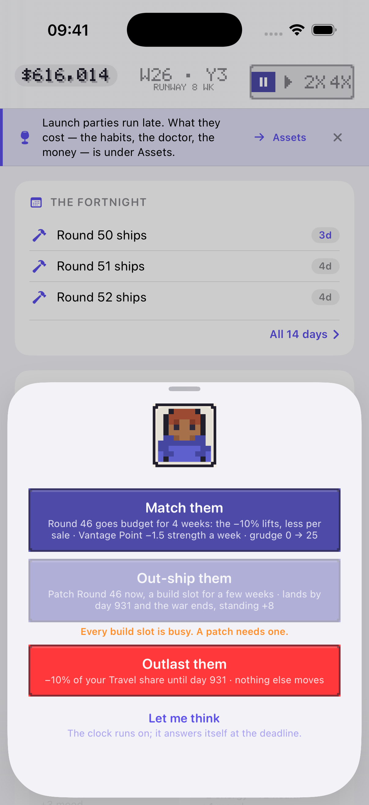 |  |

**Measured.** `DecisionSheet.swift:102` opens at `[.medium, .large]`. The
header (portrait, kicker, title, body) sits in a `ScrollView` above
buttons that stay put (`:136`). With three long options, the price war
shows the portrait and the three buttons and **no question at all**: the
title "Ironwood cut its prices in Travel" is scrolled out of the header's
~200 px. The poach body stops at "or let Zanele Yilmaz walk — they'll stay
in your address…".

The options then speak the engine's words: "the −10% lifts", "−1.5
strength a week", "grudge 0 → 25".

**Who it hurts.** Everyone, every time a sheet has three answers. This is
the most consequential screen in the game, and it is the one that fails
visibly.

### 5. Five tabs, five navigation grammars

**Measured.** From the screenshots and code:

| Tab | How it navigates |
|---|---|
| HQ | Scroll, sheets, 2 pushed story screens, a tappable office |
| Life | Scroll, 17 pushed destinations (`LifeScreen.swift:32-85`), sheets, a full-screen city map |
| Team | Segmented Roster / Org chart, then List sections |
| Products | Segmented Products / R&D, then cards, then a full-screen war room |
| Business | Six-pill grid, a desk card, a *second* segmented picker inside Market (Report / Map), a pushed rival profile |

Across `App/Sources`: 76 `.sheet`, 30 `.confirmationDialog`, 8
`.fullScreenCover`, 11 segmented pickers, 1 pill bar, 22 `Menu`s, the rail
with swipe and +N, the phone, and office hit regions.

There is no rule for when a surface is a sheet and when it is a pushed
page:

- The door is a pushed page (`LifeDestination.door`).
- The pitch room is a sheet over a card.
- The courtroom is a sheet over a pushed page.
- The city map is a full-screen cover.
- The war room is a full-screen cover.

**Who it hurts.** Hour one learns five tabs' worth of grammar. Hour ten
cannot predict where Back goes.

### 6. Badges don't mean "this needs you"

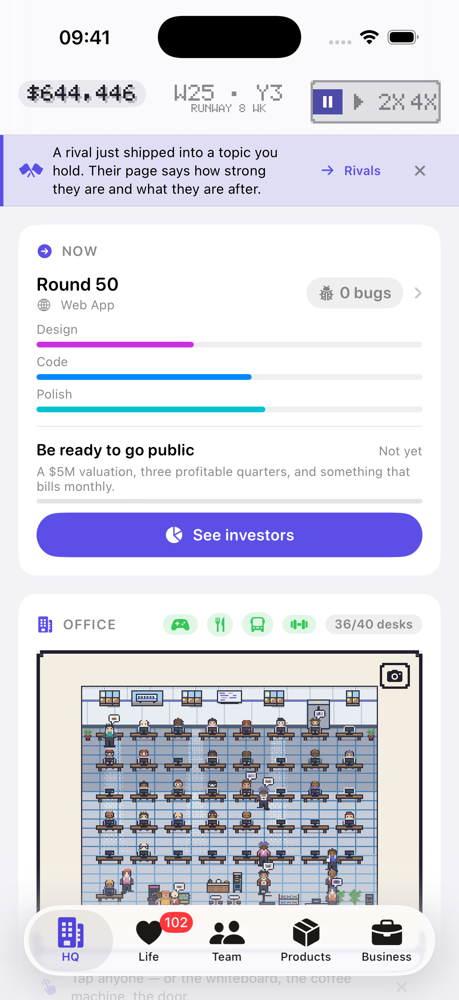

**Measured.** Life's badge is `life.phone.unreadCount`
(`AppRootView.swift:361`): 102 on the campus save, 78 on the studio save.
The phone shows the company thread holding 56 of the campus's 102. These
are weekly closes ("Week 128 closed. In $58,596…") that the weekly report
already delivered.

At the same moment, Business's desk holds three live items (a price war, a
reporter, a crash), and the Business tab has **no badge**. Neither do HQ or
Products. Only Team's badge (attention count) means what a badge should.

**Who it hurts.** Hour ten. A permanent three-digit badge teaches the
player to ignore badges, including the one on Team that matters.

### 7. The same thing lives in several places

**Measured.**

- **The week is summarised four times:** the weekly report sheet, the
  Monday newspaper, the journal, and the phone's company thread.
- **The team's work pace:**
  - Life's Your week has "The team's pace", and every in-development card
    on Products has a Relaxed/Normal/Crunch control with the same caption
    ("The pace nobody complains about"). On the campus save that is 1 + 5
    copies of what reads as one company-wide setting.
  - Screenshots `campus-life.png` and `campus-products.png`.
  - I did not tap it to confirm that they are one setting.
- **Money appears six ways:** HUD cash, the money sheet, HQ's Burn card,
  Life's Money card, Business → Finances, and the weekly report.
- **"The desk" names three different things:**
  - the front-door Morning desk card;
  - a *second* front-door row, also called "The desk"
    (`TitleMenu.swift:82`);
  - Business's "On the desk".

**Who it hurts.** Hour ten. The player can't tell which copy is the real
one, and every copy costs scroll.

### 8. Dormant systems are drawn at full weight for players who cannot use them yet

| Garage Team | Garage Business | Garage Products |
|---|---|---|
| 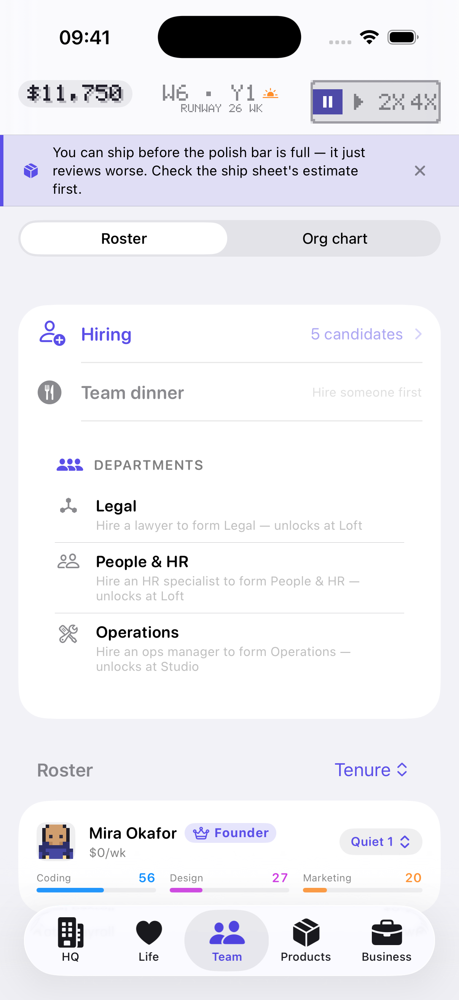 | 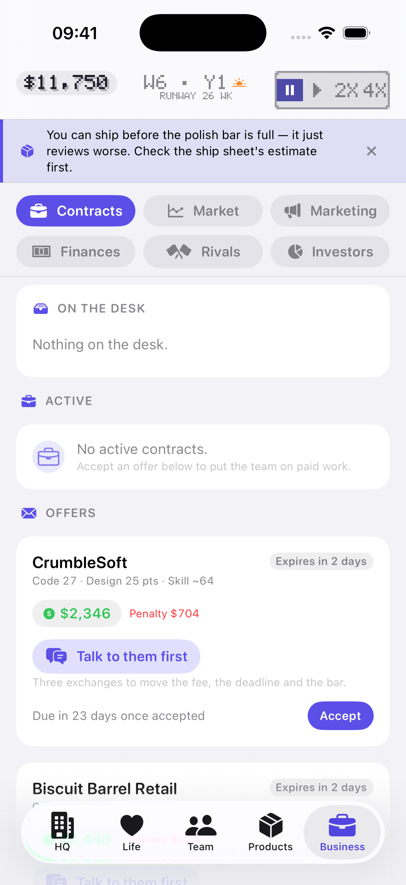 | 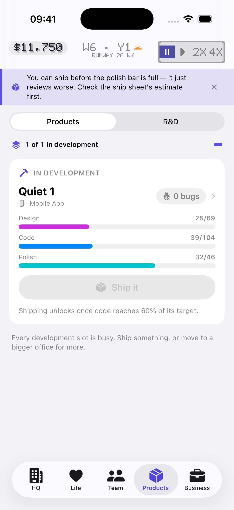 |

**Measured.**

- **Garage Team (a solo founder).** Three department rows, each "unlocks at
  Loft/Studio", take 500 px. "Team dinner — Hire someone first" is drawn
  disabled. The roster starts at 1,500 px.
- **Garage Business.** An empty desk ("Nothing on the desk") and an empty
  "No active contracts" card sit above the first actual offer, which starts
  at 1,210 px.
- **Life.** Its seven room pitches (problem 1) draw on day 40.

**Who it hurts.** Hour one. The first screens are mostly things the player
cannot do yet.

### 9. The front door has 15 entry points

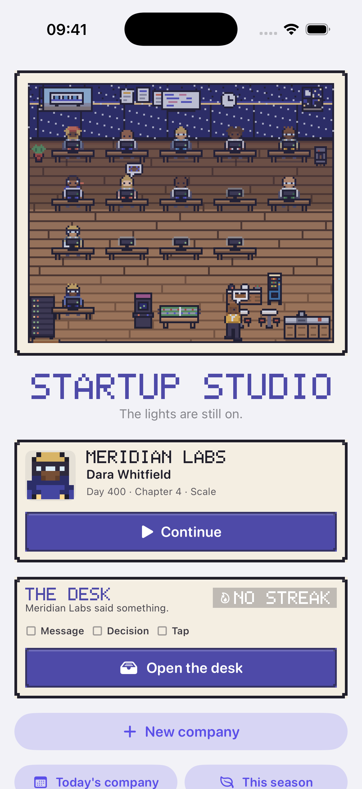

**Measured.** In order:

- Continue.
- The Morning desk card.
- New company.
- 9 menu rows (`TitleMenu.swift:70-83`): Today's company, This season,
  Scenarios, Custom company, From a code, Hall of Fame, Dynasty, League,
  and The desk again.
- 3 slot rows.

Above the fold: Continue, the desk card, New company, and half of the
first pair of rows.

A first-time player is asked to tell apart a daily, a season, a league and
scenarios before they know what a company is.

**Who it hurts.** The first launch, and every lapsed player coming back.

### 10. Numbers without hierarchy, and a hero card with the wrong content

| Studio HQ: the office letterboxed | Weekly report, for contrast |
|---|---|
| 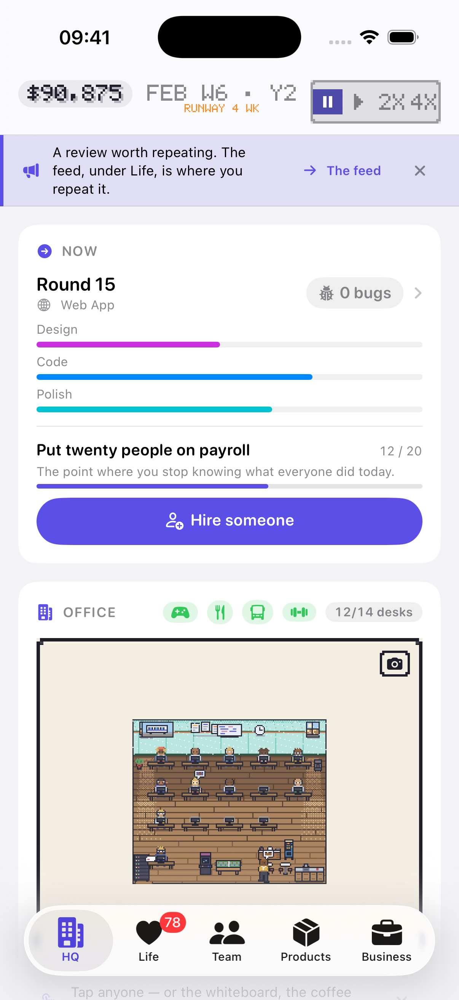 | 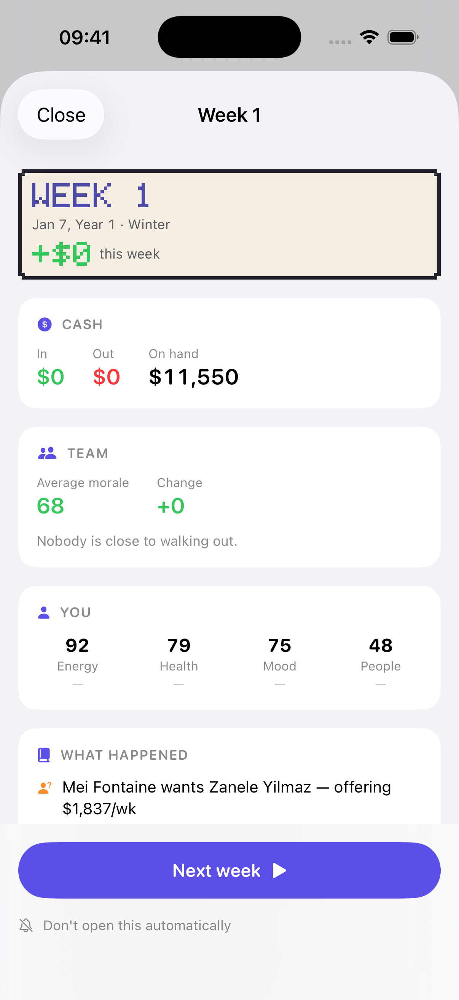 |

**Measured.**

- **Card weight.** Every card is the same `CardView`: same header, same
  padding, same type ramp.
- **Now card.** It spends about 45% of HQ's first viewport on three
  unlabelled phase bars (Design, Code, Polish; the numbers are only on
  Products). It never says the one thing a player wants from them: *when
  does it ship?*
- **Office.** On the studio tier the scene draws at 1× inside a full-width
  paper frame, so about 60% of the office card is empty paper.
- **Word count.** HQ's first viewport is about 55 words (tip 22, Now card
  about 25) and 7 numbers.

The weekly report is the counter-example. It has five blocks, big numbers
with small labels, one button, and it reads in three seconds.

**Who it hurts.** Both hour one and hour ten. The eye has no first place to
land.

### Measurements in one place

| Measure | Value |
|---|---|
| Cards per tab (garage / campus) | HQ 5 + settings / 5 + settings. Life 19 / 20 (of 25 slots) + 4 headers. Team 2 blocks + 1 roster row / 3–4 blocks + 35 rows. Products 1 / 5 build cards + released + catalog. Business desk + 2 empty / desk + about 6 in Market |
| Navigation grammars met in the first ten minutes | ≥ 8: tab bar, rail, Now-card sheet (4-step product flow), decision sheet, weekly report sheet, segmented picker, `Menu` pickers on Life, office taps. The tour opens Business and its pill bar by the desk beat |
| Taps from HQ: start a build | 1 (Now) + 4 flow steps (Type, Base, Topic, Details) + confirm |
| Taps from HQ: hire | 2 (office door → sheet), or 3 (Team → Hiring → Hire); code, not tapped |
| Taps from HQ: set price | 3 plus two scrolls (Products → released product → live-ops tier); code, not tapped |
| Taps from HQ: answer the rail | 1 if it is the leader, otherwise swipe to cycle |
| Taps from HQ: open the weekly report | 1 while unread. Once closed, **no way back**: `WeeklyReportSheet` is presented only from `AppRootView.swift:328`, on `pendingReportWeek` |
| Words above the fold on HQ | about 55, plus the HUD |
| Numbers on Life | about 12 above the fold; about 130 on the whole family-save scroll |
| Front-door entry points | 15 |
| Question surfaces | 7, for 15 queue kinds |
| Iteration 9–12 rooms that can be found without a tip | See the table below |

| Room | Where it lives | Found without a tip? |
|---|---|---|
| Doors | Life card 25 of 25, plus the rail and the phone | Yes, through the rail. Not on Life |
| Feed / fame | Life card 22 | Only by scrolling. The tip says "under Life" |
| Assets / doctor / vices | Life card 21 | The tip says "under Assets" |
| Crime / court | Life card 20; a case also reaches the rail | Only once a case exists |
| Family drama | Life card 23 | Only by scrolling |
| Espionage | Rival profile, below the fold (W3 needed `-autoSpyCard` to photograph it) | No |
| Dirty money | Business → Finances | Only when the offer reaches the rail |
| Office secrets | Team section, plus office clues | Partly |
| House field | Front door → League | Only from the door |
| Announce | Products build card and sheet, plus a rail countdown | Yes, once a build has an ETA |

---

## C. Simplification plan

Eleven changes. None removes a system; each hides, groups or sequences. The
first five carry most of the effect.

**About the snapshot tests.** They render and write PNGs, and assert only
that the image is not empty (`SnapshotTests.swift:52`). They do not compare
against references. So "re-record" below means *the PNG output changes and
must be reviewed and reported as a re-pin*, not "the test fails". Where a
test asserts structure, it is called out as a real break.

### C1. Life in five folded sections · L

**Before:** 25 peers under 4 headers, about 130 numbers.
**After:** five sections, three open by default:

1. **This week.** Fortnight and Your week merged into one card, followed by
   the activities.
2. **People.** Phone, Partner, Family, Friends and Networking, each a
   one-line row with its one number, pushing its page.
3. **Money and home.**
4. **You.** Skills and Meters.
5. **More of your life.** The rooms, one row each. A row is lit when
   something in it waits on you.

Closed sections show a single summary line ("People · Priya 64 ♥ · 2 kids ·
3 messages asking"). The open or closed state is remembered per install.

- **Files:** `LifeScreen.swift` and a small `LifeSection` container. The
  card files are untouched: each card is still what a section expands to.
- **Must not break:**
  - every `-autoRoute` Life landing (`consumeRoute` stays as it is, since
    pushes do not depend on card order);
  - `AgendaCard` and `ThisWeekCard` if merged: keep both types and nest
    them;
  - the J1 door route.
- **Tests:**
  - `IPadColumnSnapshotTests.testTheFiveTabRootsHoldTheColumnAt820`: the
    life root PNG re-records; its gutter check must still pass.
  - `LifeBusinessSnapshotTests.testThisWeekLeadsLife` and
    `AgendaOrgChartSnapshotTests.testTheFortnightCardLeadsLife` render the
    cards alone, so their PNGs are unchanged. Their names stay true only if
    this section leads Life.

### C2. Rooms stay dormant until their door opens · M

**Before:** Crime, Assets, Fame, Family drama, Side project, Sabbatical and
Life score draw an invitation card on every save from day 0.
**After:** each draws nothing on Life until its state is non-empty or
something opened it (a door, an event, a case, a first post). Until then it
is one quiet row in "More of your life" (C1). Four coach tips turn from
directions ("under Life") into a route button with neutral copy.

- **Files:** the seven cards' `body` guards (`Crime/CrimeCard.swift:21`,
  `Assets/AssetsCard.swift:23`, `Feed/FameCard.swift:25`,
  `Family/FamilyDramaCard.swift:45`, `SideProject/SideProjectCard.swift:31`,
  `Sabbatical/SabbaticalCard.swift:28`, `LifeScore/LifeScoreCard`), and the
  tip copy in `CoachTip.stateTip`.
- **Must not break:**
  - the rooms' `-autoRoute` landings (they push directly);
  - J1's four doors, which must still land in their rooms on a yes;
  - J1's `.armDoors` gate;
  - tip ids, because dismissal is per install.
- **Tests:** none reference these seven cards. The fixtures are unaffected.

### C3. The rail is one line, and a tip is said once · S

**Before:** a three-line tip, the same one on all five tabs, plus a second
tip strip under the office.
**After:**

- The rail is `lineLimit(1)` with the full text on tap.
- A tip shows on the tab it concerns (or HQ), and at most once per session
  per tip.
- The office hint moves into the rail as an ordinary tip.
- The ▶ in the rail is dropped when a dot already marks the speed control.
  The play button in the HUD is the one control for time.

Chrome goes from 412 px to about 330 px on every tab.

- **Files:** `NoticeRail.swift`, `TipStrip.swift`, `OfficeTaps.swift:148`.
- **Must not break:** the tour beats, which are rail notices at priority 1
  (`TutorialScriptTests`: 24 tests, including tab gating); J6's queue rows
  and deadlines; J5's countdown.
- **Tests:** `NoticeRailSnapshotTests` re-records all 8 PNGs.
  `OfficeTapSnapshotTests` re-records. Check that
  `Iteration7ScaffoldAppTests` (rail priority order, line 39) still holds.

### C4. The decision sheet always shows its question · S

**Before:** at the medium detent, the header scrolls out behind the pinned
buttons. The price war shows no title at all.
**After:**

- The kicker, title and first two lines of the body sit outside the
  `ScrollView`, and the portrait shrinks to 48 pt at the medium detent.
- A prompt with three or more options, or a body over about 120
  characters, opens at `.large`.
- Engine words in option lines ("lifts", "strength", "grudge") get player
  words in `PriceWarPrompt` and `DecisionSheet` builders. The after-state
  money line stays exactly as it is.

- **Files:** `DecisionSheet.swift:100-150`,
  `Screens/Business/RivalFight/PriceWarPrompt.swift`.
- **Must not break:**
  - "Let me think" and the modal category challenge (J6 pins it modal);
  - `-autoAnswer` and the other debug answer loops, which read
    `DecisionPrompt`, not the view.
- **Tests:** `DecisionSheetSnapshotTests` (10, including
  `testTheTitleSurvivesAccessibilitySizes`) and `RivalFightSnapshotTests`
  re-record.

### C5. One inbox: +N opens "Waiting on you" · M

**Before:** 7 question surfaces, and +N opens the journal.
**After:** the rail's +N opens a single sheet listing every open question.
It combines the `QueueBoard` entries, open doors, phone threads that are
asking, and dated desk rows due within 7 days. Each has its deadline and a
button that goes where the rail would. The journal stays on HQ as the log.

The desk card and the Morning desk read the same list, so they cannot
disagree. The day-7 poach ("currently $0/wk") is a pacing issue to raise
with the engine owner; it is not a UI fix.

- **Files:** `NoticeRail.swift` (the +N target), a new `WaitingSheet`
  alongside it, and `Screens/Business/DeskCard.swift` (the source only).
- **Must not break:**
  - `QueueBoard` ordering, which is derived and never stored, so this is
    free;
  - J6's rule that a sheet appears on the rail only once put off and only
    while the clock runs;
  - J1's 14-day door rows.
- **Tests:** `NoticeRailSnapshotTests.testABusyDayShowsTheLeaderAndACount`
  re-records. No structural assertion covers the +N target.

### C6. Badges count what needs you · S

**Before:** Life reads 102 unread messages. Business has nothing, despite
three live desk items.
**After:**

- **Life:** phone threads that are *asking*, plus open doors, plus Life
  queue items.
- **Business:** desk rows due within 7 days.
- **Team:** unchanged.
- **HQ and Products:** none.
- **Phone:** the company thread's weekly closes stop counting as unread,
  since the report is the delivery.

- **Files:** `AppRootView.swift:342-394`, plus an app-side filter over
  `life.phone` (engine untouched).
- **Must not break:** the phone's own unread dots inside the Phone page.
- **Tests:** none.

### C7. Business: one row of pills, and a desk that leads · S

**Before:** a 3×2 pill grid (213 px), "Contr…" truncated, then the desk.
**After:** a single horizontally scrolling pill row (about 60 px) with
badges from C6, below the desk card. Investors appears once a term sheet or
a seated board exists; until then that pill is hidden, not disabled.
Market's inner Report / Map picker becomes a toolbar toggle on the section,
so Business has one segmented control, not two.

- **Files:** `BusinessScreen.swift:79-90`, `Components/SegmentPillBar.swift`,
  `MarketView`.
- **Must not break:** every Business deep link (`consumeRoute`, pitch, suit,
  spy, dirty money, investors), and `-autoRoute marketmap`.
- **Tests:**
  - `LifeBusinessSnapshotTests.testSixPillsLayOutAsAGridWithBadges`: the
    PNG re-records, and its name becomes false. Report it as a re-pin.
  - `MarketMapSnapshotTests` and the IPad column test re-record.

### C8. Stage-gate the dormant rows · S

**Before:** a solo garage founder sees three locked departments (500 px)
and a disabled Team dinner.
**After:**

- Departments shows one line ("Departments open at the Loft") until the
  Loft, and full rows only once one can be formed.
- Team dinner and Assign everyone appear at headcount 2.
- Business's empty Active contracts card collapses into the desk's
  empty-state line.

- **Files:** `Screens/HQ/DepartmentsCard.swift` (it is drawn on Team),
  `Screens/Team/TeamScreen.swift:177-217`, `ContractsView`.
- **Must not break:** tour beat `hire` (`TutorialScriptTests.testHireEnds…`).
- **Tests:** the IPad column test's team root re-records.

### C9. A front door with three choices · S

**Before:** 15 entry points.
**After:**

1. **Continue**, with the Morning desk folded *into* the Continue card as
   one line ("3 things on the desk").
2. **New company.**
3. **More ways to play**, a sheet with the nine rows in three groups:
   - *Today:* Daily, Season, League.
   - *Set up:* Scenarios, Custom, From a code.
   - *Remember:* Hall of Fame, Dynasty.

The duplicate "The desk" row goes. Slots move behind a small "Saves"
button on the Continue card.

- **Files:** `FrontDoor/TitleScreen.swift` and `FrontDoor/TitleMenu.swift`
  (the view only).
- **Must not break:**
  - **Keep `TitleMenu`'s nine `Row`s and their order as data.**
    `Iteration7ScaffoldAppTests.testTitleMenuAndOnboardingPagesStayOffUntilALaneFlipsThem`
    asserts `rows.count == 9` and the enabled order, and
    `CustomCompanyTests.testTheTitleMenuOffersCustomAndFromCode` checks the
    ids. Only `TitleMenuView`'s presentation changes.
  - `-autoDaily`, `-autoLeague`, `-autoDesk`, `-autoScenario` and
    `-autoRoom hall` all open from `onAppear`, not from rows, so they are
    unaffected.
- **Tests:** `FrontDoorSnapshotTests` (3),
  `AccessibilitySizeSnapshotTests.testTheTitleScreenHolds…` and
  `HeirloomsSnapshotTests` re-record.

### C10. One home per thing · M

- **Work pace** gets one control. It moves to the Products header (one per
  tab, not one per build). Life's Your week shows it as a read-only line
  that links there. If the product-card control is really per-build, this
  item becomes "label it per-build" instead; verify by tapping first.
- **The weekly summary** keeps the report and the newspaper. The phone's
  company thread stops restating weekly closes.
- **The report can be reopened.** The journal's week row and the rail's
  journal link it (today, a closed report is gone).
- **Naming:** Morning desk becomes **"Morning papers"**, so "the desk"
  means Business alone.

- **Files:** `ProductsListView.swift`, `ThisWeekCard.swift`, `JournalCard`,
  `AppRootView.swift:328` (the presenter), the phone thread composer, and
  `MorningDeskCard` copy.
- **Must not break:**
  - the crunch cross-effects (README: the two crunches can see each other),
    which are engine-side and untouched;
  - `WeeklyReportTests`;
  - M5's streak.
- **Tests:** `ProductLoopSnapshotTests` and `FounderLifeSnapshotTests`
  re-record.

### C11. Three card weights, and a Now card that answers "when" · M

**Before:** every card is the same `CardView`. Now spends 45% of the fold on
three unlabelled bars. The studio office is letterboxed in paper.
**After:**

- **Three weights:**
  - **primary:** Now, Your week, the desk; full size, one per tab;
  - **row:** title, one number and a chevron, 56 pt;
  - **quiet:** a single secondary line in a grouped list.
- **Now card:** its three bars collapse into one segmented phase bar with
  "Ships in about 9 days" (`GameState.buildETA` already exists), which
  frees about 200 px.
- **Office:** the scene takes the next integer scale that fits the card
  width, or the card shrinks to the scene. No paper margin wider than one
  tile.
- HQ below the office becomes one "Company" card with three rows (Burn and
  runway, Chapter, Journal).

- **Files:** `Components/CardView.swift` (add `.row` / `.quiet` styles),
  `HQ/NowCard.swift`, `Components/PhaseProgress.swift`,
  `HQ/OfficeCard.swift`, `HQScreen.swift`.
- **Must not break:**
  - `HQSnapshotTests.testTheNowCardLeadsWithTheFirstGoalAndItsAction` and
    `testEveryChapterOneGoalHasAnAction`, which assert `NowAction` for
    every chapter-1 goal. Keep the action table.
  - the office hit regions (`OfficeTapSnapshotTests`);
  - the PixelKit palette tests.
- **Tests:** `HQSnapshotTests` (4), `OriginsSnapshotTests`,
  `LadderSnapshotTests` (GoalsCard) and the IPad column test re-record.

### Order and size

C4 → C3 → C6 → C8 → C9 → C7 are all small, and together they fix what
every player sees in the first hour. Then C1 + C2 (the Life restructure),
C5, C11, C10. Rough size: 6 S, 4 M, 1 L.

---

## D. What to leave alone

- **The weekly report.** Five blocks, big numbers, one button,
  "Don't open this automatically". It is the best-designed screen in the
  game and the model for C11.
- **The HUD bar itself.** Cash, date, runway under the date, and speed.
  Runway in the HUD was the right call. Only the rail beneath it needs
  work.
- **The door page (the shark).** One story, two answers, a stated
  consequence, and the deadline in one line. It is the model for how every
  room should ask something. Keep the page; just stop hiding the card at
  position 25.
- **The desk card on Business.** Cross-section urgency with routes is the
  right idea. C5 and C7 make it lead and feed it; they don't replace it.
- **The Now card as a concept, and the Fortnight.** "Every tab lands on the
  next thing" was right. The problem is what sits *below* them.
- **Money lines on decision options** ("−$2,300 → $9,250 · runway 8 wk").
  Dense, but they are exactly the numbers the choice needs.
- **The office as HQ's face,** and its tap regions.
- **The phone as a medium.** Messages from people are a good channel for
  doors and friends. The problem is only the company's weekly closes
  flooding it (C6, C10).
- **Five tabs.** The split is right. Don't add a sixth "Rooms" tab; it would
  be a junk drawer, and the rooms belong to Life or Business by what they
  touch.
- **Pixel chrome for the game layer, system chrome for controls.** It is
  consistent. Keep it.

---

## E. The target, one screen per tab

**HQ.** A one-line rail under the HUD. The **Now** card: the build with one
phase bar and "Ships in about 9 days", then the nearest goal with its
button. The **office**, scaled to its card with no paper margin. Below the
fold, one **Company** card with three rows (Burn and runway · Chapter 3 of
5 · Journal) and Settings.

**Life.** **This week** leads: the Fortnight's next three dates, three
evening pips, schedule, weekend, founder output, and today's four
activities. Then **People**, collapsed to one summary line with a badge
when someone is asking. Then **Money and home**, collapsed to "Wallet $x ·
rent due in 3d". Then **You**, collapsed to "Output ×0.88 · energy 64".
Then **More of your life**: only the rooms that are open, each a row, plus
a quiet "Other rooms" row. About 8 visible blocks, about 25 numbers above
the second fold.

**Team.** Roster / Org chart at the top. A **This week** strip: who needs
you, with Team's badge count. The roster, with Hiring as its first row.
Departments, policies and secrets in one "Company rules" section below the
roster that grows as they open. A garage founder sees their own row, the
Hiring row, and one line about the Loft.

**Products.** Products / R&D at the top. One work-pace control for the
tab. In-development builds as compact cards (name, one phase bar, ETA,
bugs, hype) that expand on tap. Released products as rows with their price
tier visible and one tap to change it. The catalog while a slot is free.

**Business.** The **desk** leads, badged, most urgent first. Under it, one
scrolling row of pills: Contracts · Market · Marketing · Finances · Rivals,
plus Investors once there is something to invest in. Then the section.
Market uses one toggle for Report / Map. On a quiet garage day: "Nothing on
the desk" and the first contract offer, both above the fold.

**Front door.** The night office, the title, **Continue** (with the
founder, the day, a Saves button and "3 things in the morning papers"),
**New company**, and **More ways to play**.

---

*Screenshots are in `docs/product/iteration-13-ux-audit/` (21 PNGs,
iPhone 17 class, 1206×2622). The simulator was shut down after the pass,
and `App/Config/Version.xcconfig` was restored with `git checkout`.*
